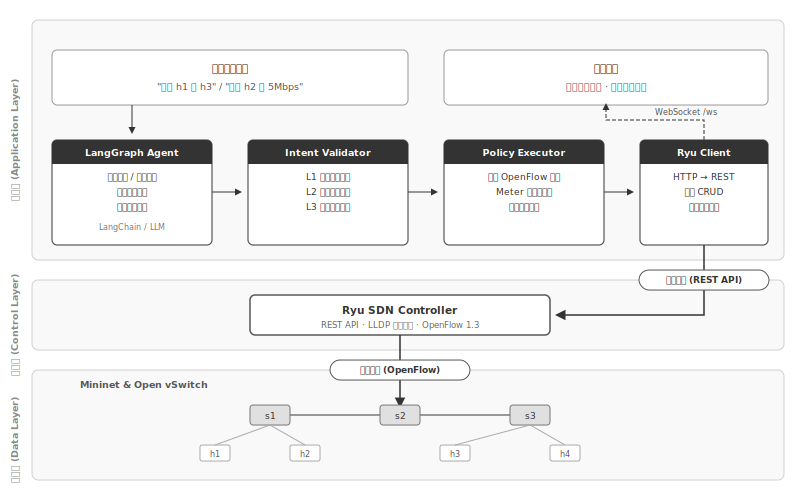
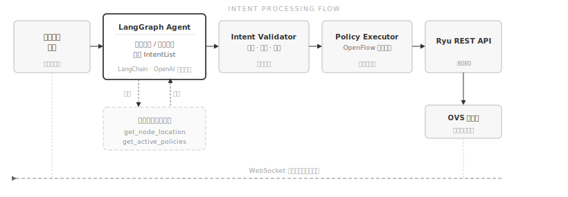
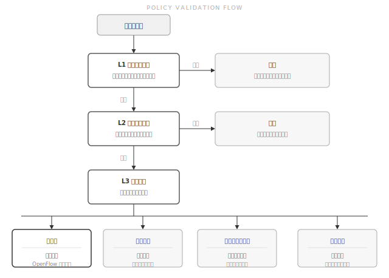

<div align="center">

# IBN System

**用自然语言管理 SDN 网络**

[](https://www.python.org/)
[](https://fastapi.tiangolo.com)
[](https://react.dev)
[](./LICENSE)

</div>

---

IBN System 是一个运行在 Ryu/Mininet 虚拟网络环境上的网络管理系统。管理员输入自然语言，系统将其解析为 OpenFlow 流表规则并下发；拓扑、流量统计和执行结果通过 WebSocket 实时同步至前端。

## 系统架构



## 工作流程



## 使用示例

以下是系统支持的部分指令，直接在前端输入框中输入即可：

```
隔离 h1 和 h3，让它们不能互相通信
把 h2 到 h4 的流量限制在 5 Mbps
限制 h1 到 h3 的 SSH 流量
把 h1 和 h2 划分到 VLAN 10
在 h1 和 h2 之间启用多路径负载均衡
先限制 h1 到 h2 带宽 3 Mbps，再隔离 h3   ← 复合指令，自动拆分执行
清除 s1 上的所有自定义规则               ← 需要在前端二次确认
```

每条策略在执行前都经过三层校验：



---

## 快速开始

**依赖**：Windows 主机（Python 3.10+，Node.js 18+）+ Ubuntu VM（Ryu，Mininet，OVS）

```powershell
python -m venv .venv
.\.venv\Scripts\pip install -r backend\requirements.txt
cd frontend; npm install; cd ..
Copy-Item backend\.env.example backend\.env
# 编辑 backend\.env，填入 LLM_API_KEY 和 RYU_REST_URL
```

```powershell
# 终端 1
.\.venv\Scripts\uvicorn backend.main:app --host 0.0.0.0 --port 8000 --reload
# 终端 2
cd frontend; npm run dev
```

```bash
# Ubuntu VM
sudo bash ~/Desktop/vm-agent/startup.sh
```

前端地址：`http://localhost:5173`。完整部署说明见 [USAGE.md](./USAGE.md)。

---

## 项目结构

```
AskAnything/
├── backend/
│   ├── core/
│   │   ├── workflow.py          # LangGraph Agent 状态机（核心入口）
│   │   ├── intent_validator.py  # 策略校验（拓扑 / 安全 / 冲突）
│   │   ├── policy_executor.py   # OpenFlow 指令构造与下发
│   │   ├── ryu_client.py        # Ryu REST API 客户端
│   │   └── topology_manager.py  # LLDP 拓扑轮询
│   ├── api/                     # REST 路由 + WebSocket
│   ├── models/                  # Pydantic 数据模型
│   └── main.py
├── frontend/
│   └── src/
│       ├── components/          # 拓扑图、对话框、流量图表
│       ├── stores/              # Zustand 状态管理
│       └── api/                 # HTTP + WebSocket 客户端
├── vm-agent/
│   ├── ryu_controller.py        # Ryu 控制器
│   ├── mininet_topology.py      # 拓扑定义
│   ├── topology*.json           # 拓扑配置（线型 / 环型 / 多路径 / 胖树）
│   └── startup.sh
├── docs/
│   ├── architecture.svg
│   ├── intent_flow.svg
│   └── validation_flow.svg
└── USAGE.md
```

---

MIT License
